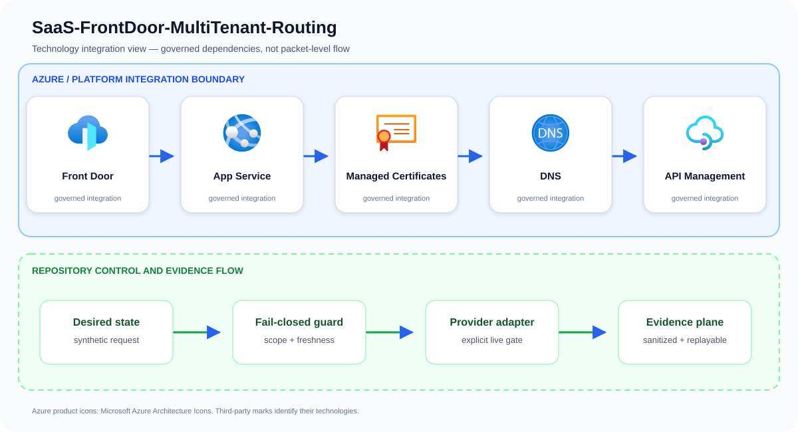
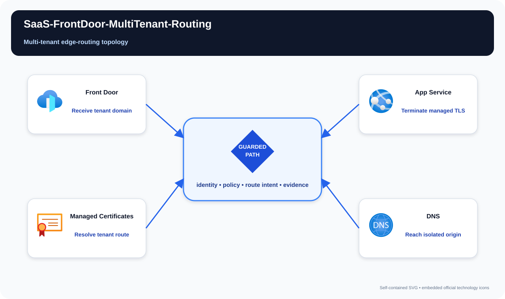

# SaaS-FrontDoor-MultiTenant-Routing

Automate secure custom-domain onboarding and routing for a global multi-tenant SaaS edge.

## Project metadata

The metadata below is derived from tracked source, manifests, and infrastructure
files. It describes what this repository includes; live-service integration remains
bounded by the documented deployment and validation limitations.

| Category | Included |
| --- | --- |
| Platforms | Microsoft Azure; GitHub Actions |
| Services and stack | Front Door; App Service; Managed Certificates; DNS; API Management |
| Languages and formats | Python; Bicep; Bicep parameters; Bash; JSON; YAML |
| Delivery and IaC | Bicep + `.bicepparam`; GitHub Actions CI; YAML configuration; Python validation/tests |

## Problem statement

A tenant-domain request is validated before planning DNS ownership, managed certificate issuance, WAF policy, and Front Door routing to the correct isolated backend.

A production implementation can still fail even when every resource deploys successfully. The material risk is cross-tenant impact from rushed onboarding, shared capacity, routing, or identity decisions that are difficult to unwind. The design therefore treats Front Door, App Service, Managed Certificates, and the surrounding identity and evidence controls as one reviewable system rather than unrelated configuration tasks.

## Example case study

### Situation

A SaaS company manually configures every customer domain and certificate, causing slow onboarding and routing mistakes. This pattern automates the edge lifecycle while preventing one tenant's hostname from resolving to another tenant's service.

### Response

A provider onboards a customer's custom domain at a shared edge. Domain ownership, certificate state, origin mapping, and tenant routing are verified before activation so one tenant cannot claim another's hostname.

The team first exercises the repository's synthetic approved and denied fixtures. An approved request must produce the same idempotent plan on replay; a stale, unscoped, public, or unapproved request must fail before an Azure adapter is allowed to run.

### Expected outcome

Stakeholders receive a decision package they can attach to a change record: requested scope, controls evaluated, the reason for approval or denial, and the explicit handoff to live integration. The example supports design review and incident rehearsal without pretending that a local test changed Azure.

## Architecture

A tenant control API validates domain ownership and creates Front Door custom domains, managed certificates, routes, origin mappings, WAF associations, and APIM context. Event-driven state tracking handles asynchronous DNS and certificate operations.

Primary services: `Front Door`, `App Service`, `Managed Certificates`, `DNS`, `API Management`.

This repository implements the first production-oriented vertical slice: a
fail-closed, adapter-neutral control plane that validates tenant scope,
freshness, approvals, secretless identity, private access, and the exact
project action before producing a deterministic execution plan. Azure adapters
consume that plan; they are deliberately outside the local simulator so local
tests cannot claim a live cloud change occurred.



The upper boundary names the principal services and technologies used by this repository. The lower boundary shows the implemented control flow: desired state is validated, provider action remains an explicit integration gate, and sanitized evidence is retained for review and deterministic replay.

## Best complementary diagram

**Recommended view: Multi-tenant edge-routing topology.** A topology view is the strongest complement because it makes network and identity boundaries, enforcement hops, and the governed path physically legible.



The view follows **Receive tenant domain → Terminate managed TLS → Resolve tenant route → Reach isolated origin**. Use it during design reviews, operational walkthroughs, and failure-mode discussions; use the logical architecture above when the question is which technologies integrate.

## Quickstart

Requirements: Python 3.11+ and Git. No Azure credentials are required.

```bash
./scripts/validate.sh
python3 src/control_plane.py --request examples/approved-request.json
```

The command emits canonical JSON with a stable idempotency key. The denied
fixture exits with status 2 and explains the failed invariants.

## Security boundaries

- Managed identity or workload identity only; embedded credentials are denied.
- Public network access and stale evidence are denied.
- Production and break-glass targets require explicit approval.
- The IaC entry point is opt-in and defaults to deploying nothing.
- Evidence output contains identifiers and decisions, never credential values.

## Verification and limitations

Local validation covers 13 tests, deterministic replay, JSON parsing, Python
compilation, ignore hygiene, and Bicep compilation when a compiler is present.
It does **not** prove Azure deployment, service licensing, quota, data-plane
permissions, provider/API availability, cloud failover, load, cost, or teardown.
See [`docs/test-matrix.md`](docs/test-matrix.md) and [`docs/runbook.md`](docs/runbook.md) before any integration trial.

## Community

See [`CONTRIBUTING.md`](CONTRIBUTING.md), [`SECURITY.md`](SECURITY.md), [`SUPPORT.md`](SUPPORT.md), and [`LICENSE`](LICENSE). The reference
is intentionally conservative and uses synthetic identifiers only.

## Repository guide

- [Architecture](docs/architecture.md)
- [Threat model](docs/threat-model.md)
- [Operations runbook](docs/runbook.md)
- [Test matrix](docs/test-matrix.md)
- [Cost model](docs/cost-model.md)
- [Security policy](SECURITY.md)
- [Contributing guide](CONTRIBUTING.md)
- [Support policy](SUPPORT.md)
- [Changelog](CHANGELOG.md)
- [License](LICENSE)

## Infrastructure inputs

Resource behavior and deploy-time values are intentionally separated:

- [Bicep template](infra/main.bicep) — Azure resources, modules, and security controls.
- [Bicep parameters](infra/main.bicepparam) — environment-specific names, regions, identities, and feature inputs.

Start with the parameter file's safe values, replace synthetic identifiers, and run an Azure what-if before deployment.

## Attribution

Azure product icons come from [Microsoft's official Azure Architecture Icons](https://learn.microsoft.com/azure/architecture/icons/). Open-source marks are sourced from [Simple Icons](https://simpleicons.org/) when shown; each mark identifies its respective technology.
